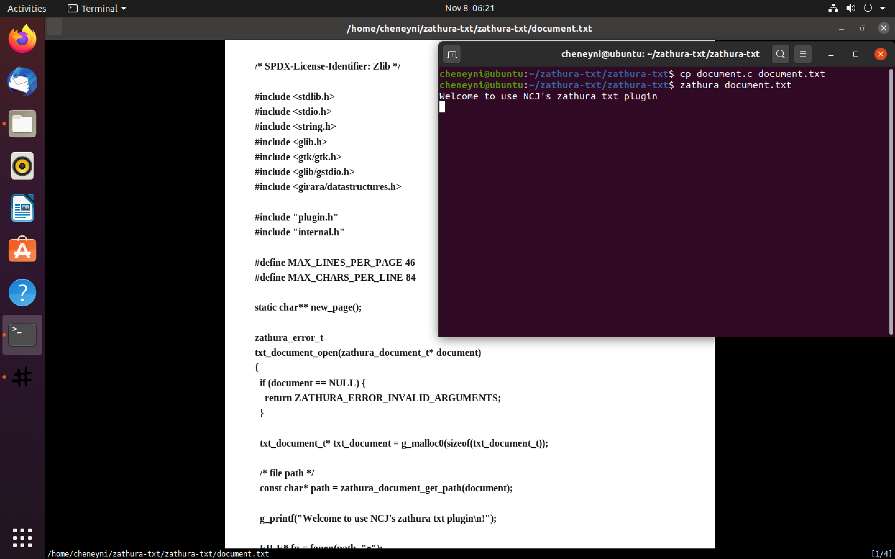
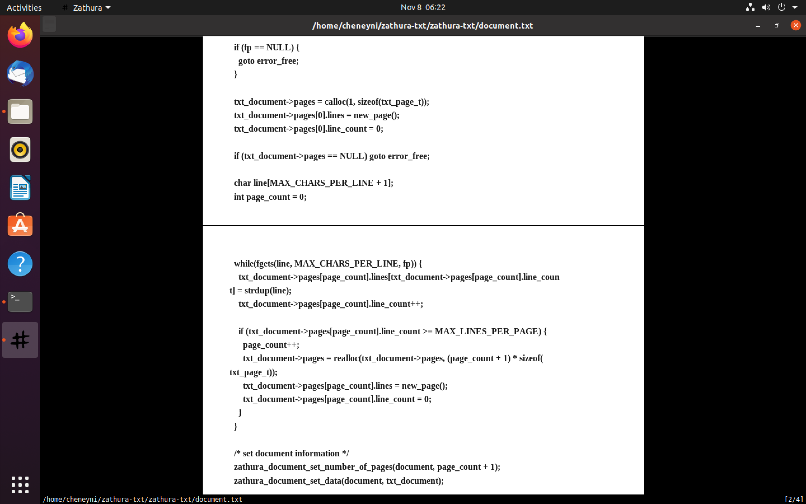

# zathura-txt

A zathura plugin to simply render plain text by Chujie Ni for VE482.

## Requirements
zathura (>= 0.2.0)
girara
cairo

## Installation

To build and install the plugin:

To support Chinese, it is necessary to set `font_face` to Chinese font in [config.h](zathura-txt/config.h)

```bash
cd zathura-txt
meson build
cd build
sudo ninja
sudo ninja install
```

## Uninstall

To delete the plugin from your system, just type:

```bash
sudo ninja uninstall
```

## Features

* Font: Times New Roman
* Auto wrapping
* Auto paging

## Demo



